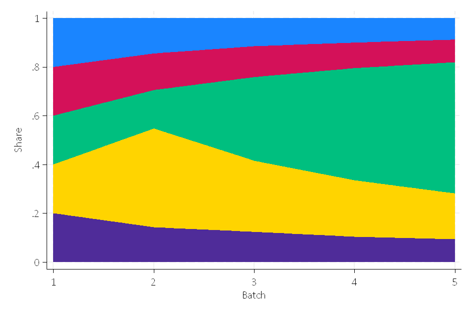

+++
title = "Assignment 1"
weight=3
extra.footer_nav=true
extra.main_nav = true
extra.sub_nav = false
+++


placeholder 


{{ anchor(title="Assignment Details")}}


## Introduction
In this project, you will implement Multi-Armed Bandit algorithms. You will use first *epsilon-greedy* (from lecture) to build a portfolio of stocks adaptively at a daily frequency. Then, you will use *Thompson Sampling* (from lecture) to compare the performance and some properties of the algorithms.

The code for this project contains the following files, which are available as a [zip archive](assigment%201.zip).

**Files you'll edit (if you do not want to use Stata but python):**

- `bbandit_functions.py`  
  Implements batched multi-armed bandit algorithms (epsilon-greedy with decay and Thompson sampling with optional clipping) for updating and simulation.
<br><br>
**Files you should read but NOT edit:**

- `bbandit_initialize.ado`  
  Initializes adaptive experiments.
- `bbandit_update.ado`  
  Runs adaptive experiments.
- `bbandit_sim.ado`  
  Runs Monte Carlo simulation of many bandit experiments.
- `bbandits.ado`  
  Calculates bandit statistics from a dataset.

<br><br>
**Files to Edit and Submit:**  
You will collect data adaptively and generate tables and figures during the assignment. You should submit these files with your code and comments. Please send tables and figures in a single pdf or html, e.g., `data.csv`, `assignment_1_solutions.pdf`.  
*Please do not change the other files in this distribution or submit any of our original files other than these files.*

**Commenting:**  
In this assignment we ask you to provide extensive commenting on the exhibits (data, tables, and figures, code) you generate. For each exhibit that you implement, provide  
1. an overall comment that describes its purpose **and** roughly how it was computed, and  
2. a per-exhibit comment (table or figure notes), describing very briefly what each exhibit is showing.  

Each per-exhibit comment can simply be a phrase at the end of your exhibit. However, you are also welcome to add separate comment lines. A portion of the project grade (3 points out of 28) will be based on an inspection of your comments in the submitted files.

**Stata or Python**  
EITHER use Stata (easier) OR Python (harder). We will use Python later, so to get an easy start, we recommend Stata. Your choice!

**Getting Help**  
You are not alone! If you find yourself stuck on something, let us know. We want this project to be rewarding and instructional, not frustrating and demoralizing. But we don't know when or how to help unless you ask.

<br><br>
## MAB Portfolios
To get started, collect data on Exchange-Traded Funds (ETFs). ETFs are pooled investment vehicles that trade on stock exchanges much like individual equities. They typically aim to track the performance of a specific index, sector, commodity, or asset class by holding a basket of underlying securities. Build a portfolio of five ETFs with the goal of maximizing total expected profits using Multi-Armed Bandit algorithms. Below are five ETFs across various categories:

- **SPY** seeks to track the performance of the S&P 500 Index, which represents 500 of the largest U.S. companies across all major sectors (e.g., technology, healthcare, financials). It represents large-cap equity.
- **GLD** is designed to reflect the performance of the price of gold bullion. It owns physical gold stored in secure vaults, so each share represents fractional ownership of actual gold bars. It offers a pure precious-metals play and crisis hedge.
- **DBC** aims to track the DBIQ Optimum Yield Diversified Commodity Index Excess Return, which holds a diversified basket of physical commodities (e.g., crude oil, gold, natural gas, copper, corn). It invests via futures contracts rather than physical delivery, rolling those contracts monthly.
- **TIP** gives inflation-linked fixed-income to protect purchasing power over time. It seeks to track the Bloomberg U.S. Treasury Inflation-Protected Securities (TIPS) Index (Series-L), which is composed of U.S. Treasury bonds whose principal adjusts with changes in the Consumer Price Index (CPI).
- **TLT** seeks to track the ICE U.S. Treasury 20+ Year Bond Index, meaning it invests exclusively in U.S. Treasury bonds with maturities of at least 20 years. A long-duration Treasury position for fixed income to profit if rates fall.

You can get daily close prices (adjusted for splits, dividends and distributions) via `yfinance`.

**Note:** Make sure to have a timeline. This is a real-life live experiment!


{{ anchor(title="Q1")}}


In each of five trading days, make 200 stock purchases in such a way that your return is maximized. Use the Multi-Armed Bandit algorithm to determine on each of the five days what share of the 200 purchases to allocate to each of the five ETFs. To do this:

1. Set up an initial dataset that specifies a unique identifier for each purchase. Assign the first 200 purchases to batch 1, the second 200 to batch 2, and so on up to batch 5. With an id for 1000 observations, you can use:  
   ```stata
   bbandit_initialize , batch(5) arms(5) exploration_phase(0)
<br>
Giving all ETFs the same chance, set the shares for each arm uniformly in the first batch. That is, set chosen_arm = 1 for the first 40 observations of batch 1, chosen_arm = 2 for the next 40 observations, etc.

Because we haven’t observed any rewards yet, the rewards are missing. Use the daily return of the adjusted close prices (corrected for splits, dividends, and distributions) as the success measure. Compute the daily return for day t as:

\[
  \text{return}_t = \frac{\text{Close}_{t} - \text{Close}_{t-1}}{\text{Close}_{t-1}}.
\]
On each day, you need to use the previous day’s closing price to compute the return. At the end of each trading day, record the reward for each purchase and update the allocation using:

bbandit_update reward chosen_arm batch, greedy eps(0.5)
Use epsilon = 1/2 for batch 2, 1/3 for batch 3, 1/4 for batch 4, and 1/5 for batch 5. Comment on better ways to decay epsilon (e.g., polynomial vs. exponential schedules).

The data could look like this:

<p style="text-align:center;"></p>
Grading: We will check your final dataset, code, dates, closing prices, and the resulting shares after five iterations.



{{ anchor(title="Q2")}}


Create the following visualizations:

A histogram showing the shares with which each arm was selected, aggregated over all batches.

A batch-wise line plot of the share (%) of each arm across batches 1 through 5.

This could look like this:

<p style="text-align:center;"></p>
Grading: We will check the shares.



{{ anchor(title="Q3")}}


**Compare three portfolio strategies:**

* A fixed, balanced allocation (20% to each ETF every day).

* The adaptive Multi-Armed Bandit portfolio allocation from Question 1.

* The ex-post optimal single ETF (the “best arm”).

* Compute the cumulative empirical regret of the Multi-Armed Bandit portfolio relative to both the fixed allocation and the ex-post optimal arm over the five-day period. That is:

\[
  \mathrm{Regret}_T = \sum_{t=1}^{T} \bigl(\mathrm{Reward}_{\mathrm{optimal},t} - \mathrm{Reward}_{\mathrm{MAB},t}\bigr)
\]


where Rewardₒₚₜ,ₜ is the reward obtained by the best arm in hindsight on day t and Rewardₘₐᵦ,ₜ is the reward obtained by your MAB portfolio on day t.

**Grading: We will check that the regret is correct in each case.**



{{ anchor(title="Q4")}}


Convert continuous daily returns into binary rewards by defining:

\[
  R_t =
    \begin{cases}
      1, & \text{if daily return}_t \ge 0,\\
      0, & \text{otherwise.}
    \end{cases}
\]

Using these binary rewards for the same five-day period, run a Thompson Sampling experiment with the same batches and batch sizes.
Note: Make sure to blind the rewards already obtained with epsilon-greedy.

Compare the resulting portfolio allocations to those from epsilon-greedy. Discuss differences in adaptation speed, concentration on the best arm, and stability.

**Grading: We will run your Thompson Sampling algorithm on the same example.**



{{ anchor(title="Q5")}}


Simulate 20 batches of 1 purchase each (batch(20), size(1)) with Thompson Sampling using true success probabilities of p₁=0.35 and p₂=0.60, no clipping, and plot_thompson and stacked options:

bbandit_sim 0.35 0.60 0.40, size(1) batch(20) clipping(0) thompson plot_thompson stacked
Plot:

The posterior Beta distributions for batch 1 and 20 for each arm.

Comment on what the flat Beta distributions in batch 1 mean and how quickly the algorithm concentrates on the better arm when p₂=0.60.

Hint: The variance of the Beta distribution is:

\mathrm{Var}[\mathrm{Beta}(\alpha,\beta)] = \frac{\alpha\,\beta}{(\alpha + \beta)^2(\alpha + \beta + 1)}.
The figures could look like this:

<p style="text-align:center;"></p>

**Grading: We will run your Thompson Sampling algorithm and check results.**



{{ anchor(title="Q6")}}

<br>
Repeat the above simulation under different settings:
<br>
Clipping rates c=0.05 and c=0.45:


bbandit_sim 0.35 0.6, size(20) batch(20) clipping(0.45) thompson 
bbandits reward chosen_arm batch

bbandit_sim 0.35 0.6, size(20) batch(20) clipping(0.05) thompson 
bbandits reward chosen_arm batch
Batch sizes 20 and 100 (with clipping 0.05):

bbandit_sim 0.35 0.60, size(20) batch(20) clipping(0.05) thompson  
bbandits reward chosen_arm batch  
bbandit_sim 0.35 0.60, size(100) batch(20) clipping(0.05) thompson  
bbandits reward chosen_arm batch
Increase the number of batches to 40 (with size 100 and clipping 0.05):

bbandit_sim 0.35 0.60, size(100) batch(40) clipping(0.05) thompson  
bbandits reward chosen_arm batch
How do the results differ in terms of:

Convergence speed to the best arm?

Stability of posterior distributions?

Regret over batches?

**Grading: We will run your Thompson Sampling algorithm and check accuracy.**



{{ anchor(title="Q7")}}


After batch 10, suppose the true success rate for arm 1 changes (e.g., from 0.35 to 0.90). Modify your Thompson Sampling algorithm to capture this non-stationarity. Possible approaches include:

Using a sliding window on recent rewards to update Beta parameters.

Applying a discount factor γ to old observations:

(α_k, β_k) = (γ α_k, γ β_k) +
  \begin{cases}
    (R_t, 1 − R_t), & \text{if chosen arm} = k,\\
    (0, 0), & \text{otherwise.}
  \end{cases}
Resetting priors after a fixed number of batches.

Implement one of these approaches and demonstrate how the algorithm adapts when arm 1 becomes better after batch 10. Plot the posterior distributions and selection frequencies before and after the change.

Congratulations! You have a learning Portfolio agent!
In order to submit your project, please send the following files: data.csv, assignment_1_solutions.pdf.

